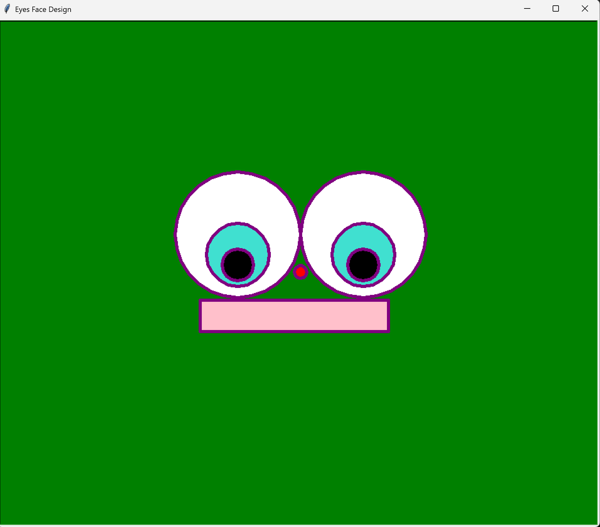

# 👀 Eyes Face — Turtle Graphic Design

A Python turtle graphics program that draws a simple face design
featuring two layered eyes, a nose, and a mouth on a green background.

---

## 📋 Features

- Draws two layered eyes each made of three concentric circles
  (white, turquoise, black)
- Draws a small red circle as a nose
- Draws a pink rectangle as a mouth
- Green background with purple pen
- Uses helper functions to avoid repeating drawing code

---

## ⚙️ How It Works

1. Two eyes are drawn on the left and right sides using
   three concentric circles each
2. A small red circle is drawn as a nose
3. A pink rectangle is drawn as a mouth

---

## 🛠️ Technologies Used

| Technology      | Purpose                                       |
|-----------------|-----------------------------------------------|
| Python 3.14     | Core programming language                     |
| `turtle`        | Drawing the graphic design                    |
| `begin_fill()`  | Filling shapes with color                     |
| `goto()`        | Positioning the turtle on screen              |
| Functions       | `draw_circle()`, `draw_eye()`, `draw_mouth()` |

---

## 🎓 Learning Outcomes

- Using `goto()` to position the turtle at specific coordinates
- Using `begin_fill()` and `end_fill()` to fill shapes
- Drawing concentric circles to create layered shapes
- Organizing repeated drawing logic into reusable functions

---

## 📁 Folder Structure

```
A2-Eyes-Design/
├── Fabrick_Marlena_A2_Eyes.py
├── A2-Eyes-Finish.png
├── .gitignore
├── LICENSE
└── README.md
```

---

## 🚀 How to Run

```bash
python Fabrick_Marlena_A2_Eyes.py
```

---

## 📸 Screenshots

### Finished Design




---

## 👩‍💻 Author

**Marlena Fabrick** — Python turtle graphics student project
